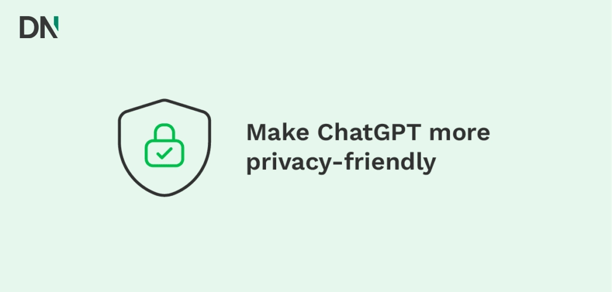

# ChatGPT数据隐私：2025年安全与隐私核心指南

---

ChatGPT现在火得不行，好像每个公司都能从中受益。越来越多的企业开始用这个聊天机器人。但随着使用人数激增，关于**数据隐私**的疑问也跟着多了起来。

Statista在东南亚四个国家做过一项调查。结果显示，将近一半的受访者担心ChatGPT这类聊天机器人会收集**个人数据**。更要命的是，42%的人对**数据隐私**和知识产权的伦理问题表示担忧。

ChatGPT还算是个新鲜事物，很多人对它在隐私和安全方面的表现有疑问。你可能也有。对这类重要话题有疑问是件好事。为了帮你搞清楚ChatGPT如何处理隐私和安全问题,我们会在这篇文章里给你答案。

---

## ChatGPT是什么?

ChatGPT是一个大型语言模型(LLM),能根据你的输入(提示词)生成文字。LLM需要训练才能提升性能。它从输入和输出中学习——换句话说,它从你输入的数据和它生成的答案中学习。ChatGPT由OpenAI开发,目前运行在他们最新的LLM GPT-4.5上,而且据说GPT-5也快要发布了。

---

## ChatGPT会保存我的数据吗?为什么?

会的,ChatGPT会保存你的数据。它保存你的提示词、聊天记录和账户详情。这些详情包括你的姓名、邮箱、IP地址和位置。收集这些信息其实挺常见的。大多数网站都会收集这类数据用于分析。ChatGPT也一样,但对他们来说,不只是为了分析这么简单。

### AI训练

ChatGPT保存数据的主要原因不是为了分析。主要原因是**训练他们的LLM**。ChatGPT是个AI模型,这意味着它会从经验中学习。它利用这些经验来改进自己,在任务中表现得更好。

有8亿周活跃用户,ChatGPT产生了大量数据。这些数据都被添加到ChatGPT庞大的知识库中。

在ChatGPT公开发布和收集用户数据之前,知识库就已经形成了。ChatGPT主要在公开信息上训练,比如在线论坛、博客和社交媒体。现在他们也用你的提示词和数据来训练模型。

### 防止幻觉

OpenAI收集数据的另一个原因是防止幻觉。有些AI模型有时会"产生幻觉"。这意味着模型不知道你问题的答案,但还是给出一个答案,让你以为那是真的。换句话说,它给你错误信息,因为它不知道正确答案。通过训练LLM模型,OpenAI可以降低幻觉的风险。

### 预防措施

OpenAI还保存你的数据来监控。监控数据的原因是防止滥用和生成有害内容。通过审查和分析错误,聊天机器人会变得更加用户友好。

---

## 为什么使用ChatGPT时数据隐私是个问题?

数据隐私的担忧一直是热门话题。尤其是随着新技术的不断涌现。质疑使用你数据的公司是明智的。ChatGPT保存所有数据这件事可能会引发疑问。

简单来说,你在ChatGPT中输入的信息可能被用来训练模型。这意味着它可能被用来为别人的问题生成答案。如果你担心这个,可以关闭用你的数据训练模型的功能。后面我们会讲如何关闭。

关闭用你的数据训练模型可能解决你自己的担忧。但世界上还有一些隐私规则,比如GDPR,问题是:ChatGPT如何遵守这些规则?

### 欧洲的GDPR

隐私领域最主要的法规是欧盟的**GDPR**(通用数据保护条例)。这项法案允许自然人保持对自己个人数据的控制。此外,它保护数据不被组织滥用。

GDPR最核心的部分之一是"被遗忘权",这意味着你可以要求组织删除你的个人数据。这也是ChatGPT容易做不到的地方。

从像ChatGPT这样经过大量训练的模型中删除某人的个人数据会是一项非常艰巨的任务。特别是要追踪哪些数据需要删除、在哪里能找到它们。而且,像ChatGPT这样的AI系统不能像人类那样遗忘,但它们可以调整数据在其知识中的重要性。简而言之,它不能删除你的数据,但可以选择不使用它。

遵守GDPR对OpenAI来说似乎是个真正的挑战。这家公司已经被一位波兰男子指控数据泄露。此外,意大利已经因为数据担忧禁用了这个聊天机器人将近一个月。所以还有很多工作要做。

### OpenAI的数据安全

除了隐私,质疑你的敏感数据在安全方面会发生什么也是明智的。OpenAI有几项措施来保护你的数据:

- **限制数据共享**。你的数据可以被授权人员或外部服务提供商审查用于监控目的。你的数据只与一组精选的可信服务提供商共享。OpenAI表示服务提供商受到"严格的保密和安全义务"约束。你的数据不会与第三方共享用于营销目的。

- **安全数据存储**。你的数据存储在OpenAI的系统上,如有必要,也存储在服务提供商的服务器上。

- **漏洞赏金计划**。OpenAI邀请你报告系统中的漏洞、bug或安全缺陷。如果你发现一些安全漏洞,可以通过漏洞赏金计划获得奖励。

- **加密**。所有与ChatGPT的对话都通过HTTPS/TLS加密。这是为了在数据在你的设备和OpenAI服务器之间传输时保护数据,但这不是像WhatsApp或Signal那样的端到端加密。

ChatGPT正在尽力缓解你的担忧。但如果你想更进一步,也可以自己掌握主动权。

---

## 如何让ChatGPT更保护隐私?

OpenAI知道人们在质疑ChatGPT的数据隐私。为了消除疑虑,OpenAI让你可以采取自己的措施。

### 在ChatGPT中使用数据控制选择退出数据训练

你的数据被用来训练ChatGPT模型。但如果你不想这样,可以选择退出。每个用户都可以通过以下步骤选择退出:

- 登录ChatGPT
- 点击左下角的你的名字
- 点击"**设置**"
- 点击"**数据控制**"
- 关闭"**为所有人改进模型**"
- ChatGPT会自动创建一个新聊天
- 现在你可以聊天而不训练模型,你的提示词不会保存在左侧的历史侧边栏中

*我们第一次写这篇文章时,数据的保留期是30天。但最近这发生了变化。美国法院命令现在要求OpenAI无限期保留所有ChatGPT对话日志,用于正在进行的版权诉讼,影响免费、Plus、Pro和Team层级*。

### 向OpenAI提交隐私请求为你的企业选择退出

除了为你自己的账户选择退出数据训练,你还可以为整个企业提交隐私请求。如果你对数据训练或数据删除有请求,可以点击右上角的"**提交隐私请求**"。之后流程会很简单。

如果你有任何其他隐私请求,可以发送到他们的电子邮件地址,你可以在同一篇文章中找到。

### 切换到ChatGPT Teams或Enterprise

另一个选择是从ChatGPT(Plus)切换到ChatGPT Teams或ChatGPT Enterprise订阅。这类订阅允许你保持对业务数据的所有权和控制权。

这类订阅有几个好处:

- **你拥有并控制你的数据**
  - 你的数据不用于训练ChatGPT
  - 你拥有你的输入和输出
  - 你决定数据保存多长时间(Enterprise)

- **你决定谁有访问权限(Enterprise)**
  - 你获得带有SAML SSO的企业级身份验证
  - 你可以控制访问权限和可用功能
  - 你的自定义模型不共享,只对你可用

- **OpenAI在安全方面提供全面合规(Enterprise)**
  - OpenAI已通过SOC 2合规审计
  - OpenAI提供静态数据加密(AES-256)和传输中加密(TLS 1.2+)
  - OpenAI有一个信任门户,你可以在那里找到更多关于安全措施的信息

*请注意,OpenAI仍会存储、审查和监控你的数据以检测滥用(最多30天)*。

如果你需要更专业的解决方案来确保数据安全和隐私合规,👉 [ChatGPT TEAM会员能为企业提供更高级别的数据保护和管理功能](https://shaoyumi.com/buy/65),特别适合对隐私要求严格的团队使用。

### 使用OpenAI API

ChatGPT Enterprise订阅的好处也适用于OpenAI API平台。你可以在上面的部分找到这些好处。简而言之,你的数据不用于训练模型,并且受到广泛保护。

OpenAI API可用于将你自己的应用程序连接到ChatGPT。例如,你可以使用API生成内容或翻译文本。最棒的是你的数据不会用于训练OpenAI的AI模型。

*请注意,OpenAI仍会存储、审查和监控你的数据以检测滥用(最多30天)*。

### Azure OpenAI服务

微软提供一项服务,你可以使用OpenAI模型创建自己的AI应用程序。通过Azure OpenAI服务,你可以构建自己的聊天机器人、内容创建器等等。最棒的是你的数据不用于训练他们的模型。微软控制该服务,这意味着OpenAI无法访问你的输入和输出。

然而,Azure仍然监控你的数据以防止滥用和有害内容生成。微软安全地存储提示词和生成的输出最多三十天。之后你的数据将从微软的服务器中删除。

但是,你可以获得监控豁免。你可以提出请求,让微软不处理你的数据进行滥用检测。这对使用敏感、机密或法律数据但仍想使用Azure OpenAI服务的组织可能是相关的。

关于Azure OpenAI服务如何处理数据隐私的更多信息可以在这里找到。

### 关于ChatGPT数据隐私的一些额外提示

使用ChatGPT就像使用锤子,它是一个非常有用的工具,但使用时应该小心。如果你不小心,你会伤害自己或别人。

ChatGPT依赖数据来改进,虽然OpenAI优先保护你的数据,但在输入敏感信息时谨慎是关键。即使有高标准的安全措施,像任何在线服务一样,ChatGPT也不能完全免受潜在数据泄露的影响。

当你处理敏感数据时,请记住以下几点:

- **使用安全的WiFi网络或使用(公司)VPN**。这确保你的连接被加密,你的流量受到保护,免受未经授权方的侵害。

- **在输入数据之前三思**。总是问自己是否有必要提到那个名字、地址或组织。假设你输入的一切都会出现在公共领域。值得吗?

考虑AI即服务,这将帮助你确保以安全和尊重隐私的方式使用ChatGPT。它还可以帮助你在组织内找到ChatGPT最佳、最有影响力的用例。

---

## 使用第三方插件或GPT时要格外小心

ChatGPT插件是非常有用的工具,可以提升你的体验。插件为ChatGPT的不足之处添加功能。

重要的是要知道大多数插件由第三方拥有。这意味着OpenAI无法保护你输入的所有数据。这就是为什么在ChatGPT中使用第三方插件或GPT时应该格外小心。

---

## 结语

ChatGPT和数据隐私永远是个重要话题。这篇文章里有很多信息,可能难以理解。所以如果你对ChatGPT有任何问题,可以联系相关专业人士。

如果你正在为企业寻找更安全、更符合隐私规范的ChatGPT使用方案,👉 [ChatGPT TEAM会员能提供企业级的数据保护和管理控制](https://shaoyumi.com/buy/65),让你在享受AI便利的同时确保数据安全无忧。
